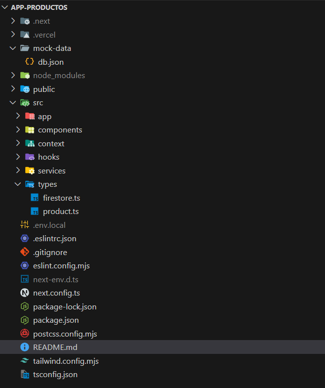
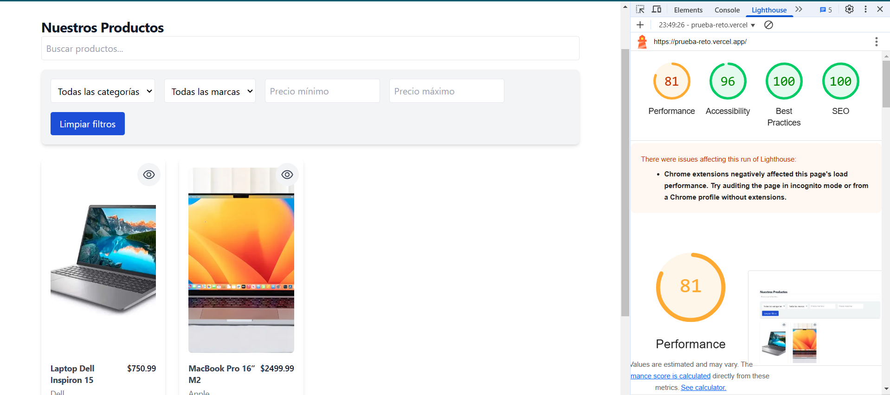
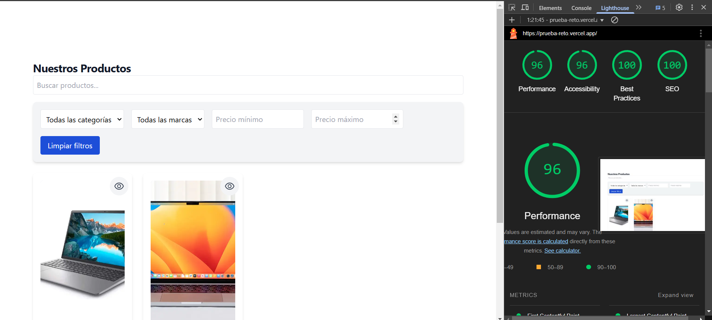
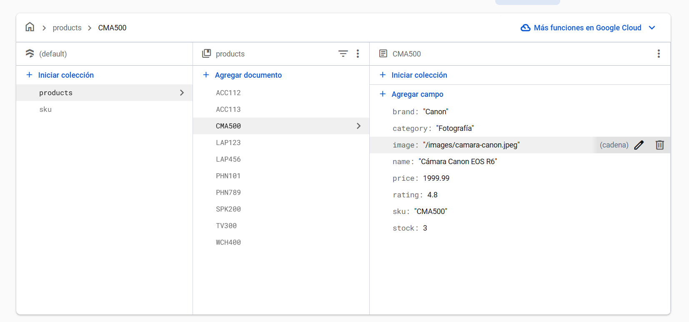
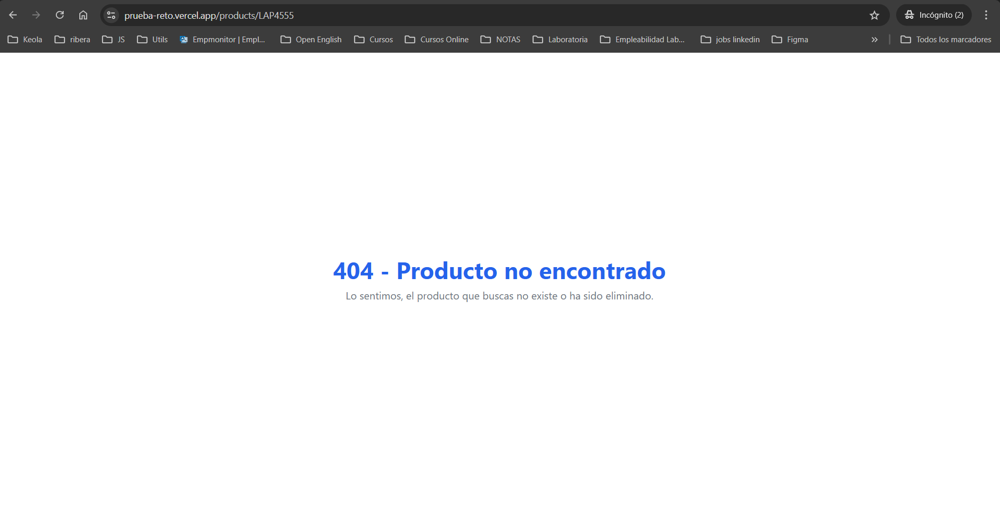
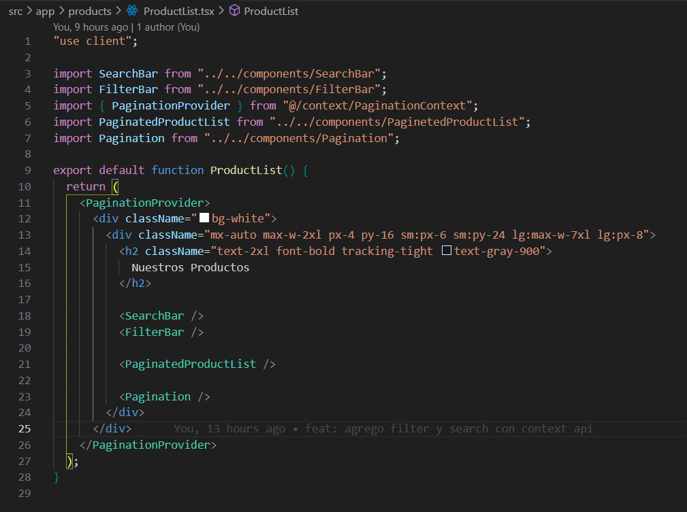
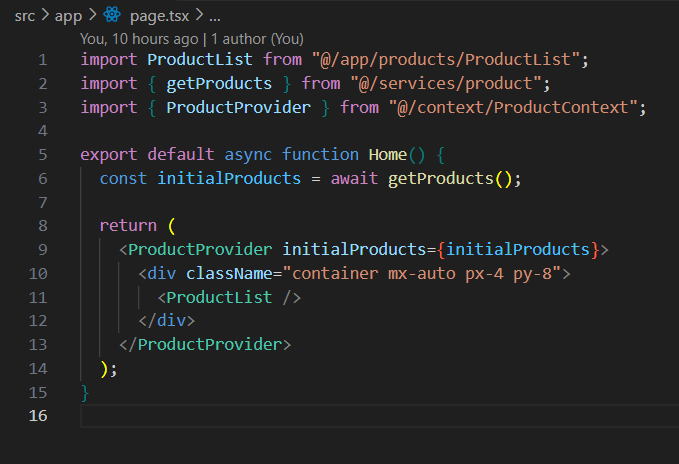

## 🛍️ Aplicación Web de Catálogo de Productos

### 📌 Descripción

Esta es una aplicación web de catálogo de productos desarrollada con Next.js 15. Utiliza Firebase Firestore como base de datos y se despliega en Vercel. La aplicación permite visualizar productos con paginación, filtros, búsqueda y detalles individuales.

### 🛠️ Tecnologías Utilizadas

Next.js 15 con App Router

TypeScript

TailwindCSS

React Query para el manejo de datos

Firebase Firestore (Base de datos)

ESLint con configuración básica

Jest y React Testing Library para pruebas

Axios para llamadas a API

React Icons para iconografía

### 🏗️ Arquitectura y Buenas Prácticas

La aplicación sigue una estructura modular y clara:

### ⚡ Performance

Uso de Server Components para optimizar la carga inicial.

Implementación de loading.tsx para mostrar estados de carga.

Optimización de imágenes con next/image.

Puntuación en Lighthouse superior al 90% en rendimiento.
Observación: Se sugiere realizar el lighthouse en una navegador que no contenga tanta extensiones ya que perjudica el analisis. Tomar en cuenta la sugerencia.

Ligthouse realizado en navegador con muchas extensiones

Ligthouse realizado en navegador sin extensiones o pocas

### 🔍 Data Fetching

Uso de React Query para un manejo eficiente de datos en caché y revalidación automática.

Integración con Firebase Firestore como fuente de datos en producción. Se realizó la base de datos en firebase debido aque para desplegar el proyecto en Vercel requeria una api de products para poder listar los productos y ver el detalle del mismo.

#### Base de Datos creada en firebase para que se listen los productos en la api creada.

#### API /products
https://firestore.googleapis.com/v1/projects/api-productos-67210/databases/(default)/documents/products

Manejo de errores con control de excepciones y notificaciones al usuario. Cuando no hay un producto en especifico se arorja la advertencia de que el producto no existe o ha sido eliminado

### 📌 Listado de Productos (PLP) - Ruta: /

✅ SSR para carga optimizada.
✅ Búsqueda con debounce (500ms) para mejorar la experiencia del usuario.✅ Filtros dinámicos por categoría y marca.
✅ Paginación funcional.
✅ Skeleton loaders para carga de contenido.

🔎 Código relevante:

#### Imagen que lista crea la primera vista que el listado de productos

#### Imagen que renderiza el listado del lado SSR

### 📌 Detalle de Producto (PDP) - Ruta: /products/:sku

✅ SSR para obtener datos del producto en el servidor.
✅ Gestión de estados de carga y errores.
✅ SEO optimizado con metadata de Next.js.
✅ Breadcrumbs para mejor navegación.

🔎 Código relevante:

export default async function ProductDetail({ params }: { params: { sku: string } }) {
  const product = await getProductBySku(params.sku);
  if (!product) return 
Producto no encontrado
;

  return (
    

      <Breadcrumb category={product.category || ''} productName={product.name} />
      <ProductCard product={product} />
    

  );
}

🚀 Deployment

La aplicación está desplegada en Vercel:
🔗 App Products en Vercel

📜 Convenciones de Commits

Se siguen las convenciones de Conventional Commits:

feat: agregar nueva funcionalidad

fix: corregir error

docs: actualizar documentación

refactor: refactorización de código

📈 Mejoras Futuras

Implementar autenticación de usuarios.

Mejorar accesibilidad según WCAG.

Optimizar renderizado con useMemo y useCallback.

Agregar tests end-to-end con Cypress.